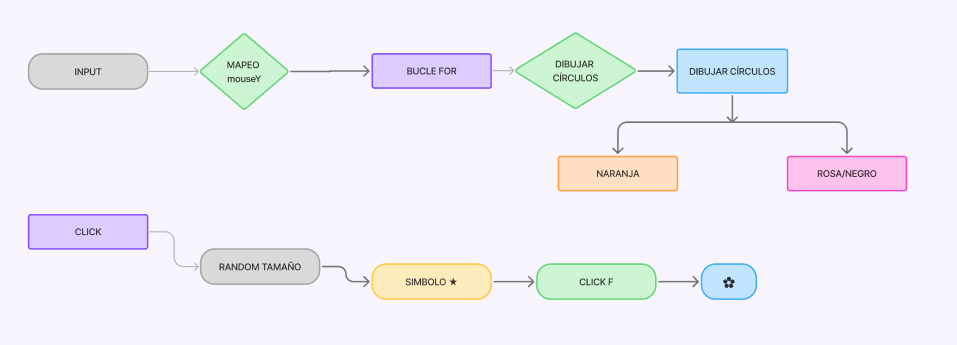
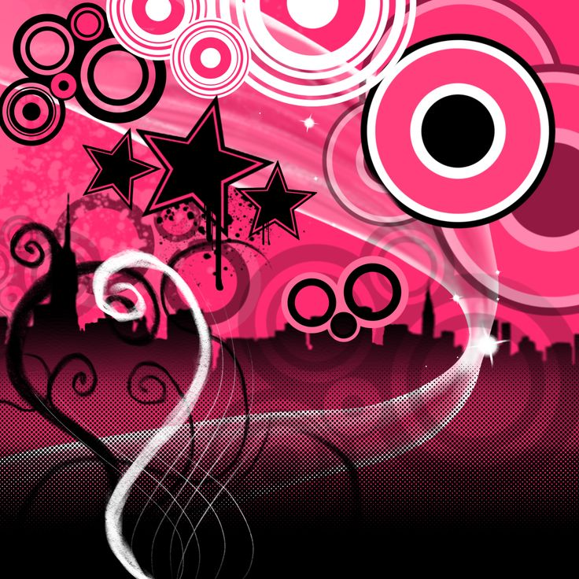
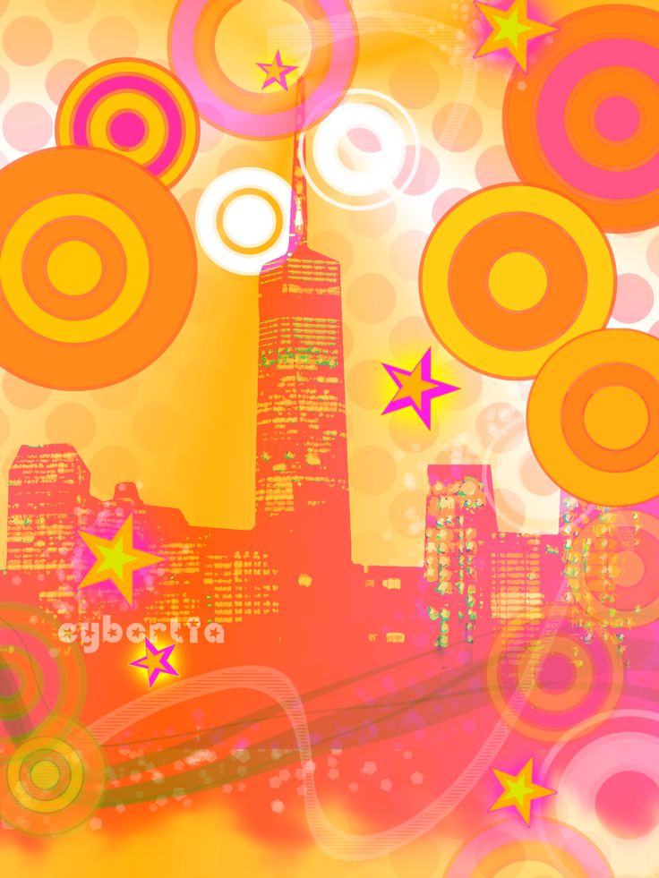
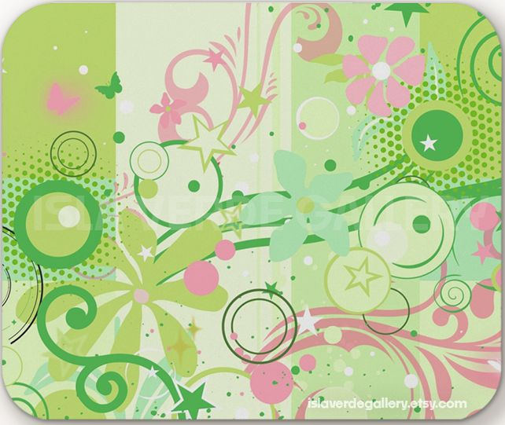
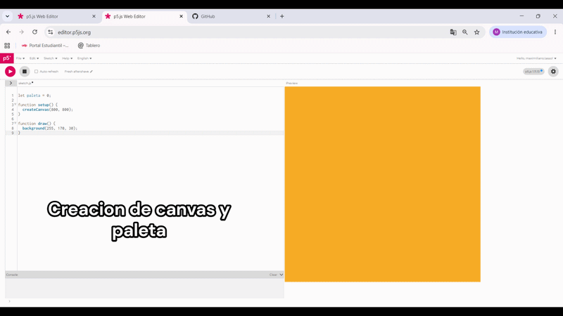
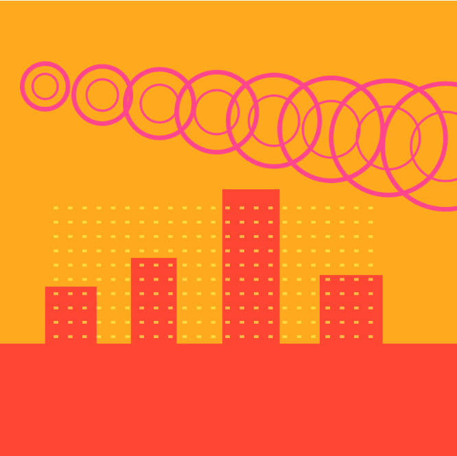

# Pensamiento-computacional-Solemne2

## 1. Información del proyecto

**Nombre del proyecto:**
Metro Bloom System

**Autores:**
Maximiliano Tasso
Bruno Jara
---

## 2. Descripción objetiva

Este proyecto consiste en un sistema visual dinámico e interactivo creado en p5.js. La propuesta toma como base la corriente visual de los 2000 **Frutiger Metro**, reinterpretando sus elementos gráficos a través de un sistema computacional. 

En pantalla se genera una composición visual de 800 x 800 píxeles formada por círculos concéntricos, una silueta de ciudad y símbolos gráficos decorativos. El sistema toma elementos característicos de Frutiger Metro como la repetición de formas vectoriales, colores saturados, elementos urbanos y gráficos inspirados en interfaces digitales de los años 2000.

Los elementos visuales principales son:

* Círculos concéntricos que aumentan y se repiten dentro del espacio en diagonal.
* Una ciudad creada a partir de figuras geométricas simples.
* Símbolos decorativos inspirados en gráficos digitales como estrellas y flores.
* Dos paletas de color: una paleta cálida naranjo/rosado y una paleta de alto contraste rosado/negro/blanco.

El sistema utiliza como input principal la posición vertical del mouse. También utiliza las teclas **S** y **F**, además del click del mouse para generar nuevas variaciones visuales.

Como output, el sistema genera una composición gráfica que cambia en tiempo real modificando cantidad de elementos, colores, símbolos y tamaños.

---

# 3. Descripción conceptual

La idea central del proyecto es reinterpretar la lógica visual de **Frutiger Metro*. En lugar de copiar una imagen específica de la corriente, el proyecto traduce sus principios principales: acumulación visual, repetición, capas gráficas y mezcla entre elementos tecnológicos y decorativos.

El proyecto dialoga con el diseño de interfaces y la gráfica digital de mediados de los 2000, donde era común encontrar composiciones con elementos vectoriales, círculos, brillos, naturaleza artificial y formas superpuestas.

### Referentes visuales, teóricos o históricos

**Frutiger Metro:**
Principal referente del proyecto. Se toma su uso de formas vectoriales, círculos concéntricos, colores saturados, elementos urbanos y composición maximalista.

**Diseño de interfaces de los 2000:**
Se utiliza como referencia la estética de fondos digitales, publicidad e interfaces que mezclaban tecnología con elementos decorativos y orgánicos.

**Diseño vectorial Y2K:**
Se toma la idea de construir imágenes mediante formas simples, repetidas y fácilmente modificables mediante reglas.

### Principio de diseño explorado

El principio de diseño explorado es la **repetición con variación**.

Los círculos funcionan como un sistema donde una misma forma se repite, pero cambia dependiendo de reglas definidas por el código como:

* cantidad
* posición
* tamaño
* color

También se explora la interacción entre usuario y sistema, donde una composición visual cambia constantemente dependiendo de las decisiones del usuario.

---

## 4. Input / Output y sistema

El sistema funciona a partir de reglas simples que conectan los inputs del usuario con cambios gráficos en pantalla.

### Inputs

* **MouseY:** posición vertical del mouse.
* **Click del mouse:** genera un símbolo en una nueva posición.
* **Tecla S:** cambia la paleta de color del sistema.
* **Tecla F:** cambia el símbolo entre estrella y flor.

---

### Procesos

1. El sistema lee constantemente la posición vertical del mouse.
2. La posición del mouse se transforma usando `map()` en una cantidad de círculos.
3. Un bucle `for` utiliza esa cantidad para generar la repetición de círculos concéntricos.
4. Cada círculo cambia su posición y tamaño utilizando la variable del bucle.
5. Al hacer click, el sistema guarda la posición del mouse.
6. `random()` genera un tamaño diferente para el símbolo.
7. Si se presiona la tecla **S**, un condicional cambia la variable de paleta.
8. Si se presiona la tecla **F**, un condicional cambia el símbolo mostrado.

---

### Outputs

* Aumento o disminución de círculos en pantalla.
* Cambio entre dos paletas de color.
* Aparición de símbolos gráficos.
* Cambio de tamaño aleatorio de los símbolos.
* Composición visual dinámica y reactiva.

---

### Reglas del sistema

* Mientras más abajo esté el mouse, más círculos aparecen.
* Los círculos siguen una repetición diagonal generada por un bucle.
* La tecla **S** funciona como interruptor de color.
* La tecla **F** cambia entre estrella y flor.
* El click decide la posición del símbolo.
* Cada click genera una variación diferente de tamaño.

---

## 5. Diagrama de flujo

---

## 6. Imágenes

### Referentes visuales

### Proceso

### Resultado final

---

## 7. Link al sketch en p5.js

[Link al sketch en p5.js](https://editor.p5js.org/maximiliano.tasso/sketches/e3x2fBOGt)

---

## 8. Bitácora breve del proceso

Primero definímos trabajar con la corriente Frutiger Metro debido a su relación con sistemas digitales, interfaces y gráficos vectoriales de los años 2000.

El primer paso fue construir los círculos concéntricos, ya que son uno de los elementos visuales más reconocibles de esta estética. Luego se utilizó un bucle para transformar un solo círculo en un sistema repetitivo.

Después se incorporó el movimiento del mouse utilizando `map()`, permitiendo que la cantidad de círculos cambie en tiempo real según la interacción del usuario.

Más adelante se agregó una silueta de ciudad creada con figuras geométricas simples, reforzando la relación con la estética urbana y digital del referente.

Luego se incorporaron símbolos gráficos como estrellas y flores mediante texto, haciendo referencia a los elementos decorativos utilizados en esta corriente visual.

Finalmente se agregaron cambios de paleta mediante teclado para generar diferentes versiones de la composición.

El resultado final es un sistema visual interactivo que transforma una estética gráfica estática en una composición generativa controlada por reglas, repetición e interacción.

## 9. Codigo escrito

//variables que controlan cosas estéticas

let paleta = 0;
let simbolo = "★";

//posición y tamaño del símbolo que aparece con click

let simboloX = 400;
let simboloY = 400;
let simboloTam = 80;
let mostrarSimbolo = false;

function setup() {
  createCanvas(800, 800);
}

//funciones que construyen el visual

function draw() {
  dibujarFondo();
  dibujarCirculos();
  dibujarCiudad();
  dibujarSimbolo();
}
  
  
function dibujarFondo() {
  
    //cambia los colores dependiendo de la paleta seleccionada
    
  if (paleta == 0) {
    background(255, 170, 30);
  } else {
    background(245, 30, 130);
  }
}

function dibujarCirculos() {
  
   //la posición vertical del mouse controla la cantidad de círculos
   
  let cantidad = map(mouseY, 0, height, 3, 14);
  cantidad = int(cantidad);

  noFill();

  if (paleta == 0) {
    stroke(255, 70, 140);
  } else {
    stroke(255);
  }

   //bucle que genera los círculos repetidos 
   
  for (let i = 0; i < cantidad; i++) {
    
    //cada círculo avanza hacia el lado y baja creando una diagonal
    
    let x = 80 + i * 100;
    let y = 150 + i * 15;
    
    //el tamaño aumenta gradualmente
    
    let tam = 80 + i * 20;

    //círculo exterior
    
    strokeWeight(8);
    circle(x, y, tam);

    //círculo interior
    
    strokeWeight(4);
    circle(x, y, tam * 0.55);
  }
}

function dibujarCiudad() {
  noStroke();

  //la ciudad cambia de color con la paleta
  
  if (paleta == 0) {
    fill(255, 70, 50);
  } else {
    fill(0, 0, 0);
  }

  //edificios creados con rectángulos
  
  rect(0, 600, width, 200);
  rect(80, 500, 90, 120);
  rect(230, 450, 80, 170);
  rect(390, 330, 100, 290);
  rect(560, 480, 110, 140);

  fill(255, 240, 80, 170);

  //bucle para repetir ventanas
  
for (let x = 95; x < 670; x += 25) {
  for (let y = 360; y < 590; y += 25) {
    rect(x, y, 8, 5);
  }
}
}

function dibujarSimbolo() {

  //solo aparece cuando el usuario hace click
  
  if (mostrarSimbolo == true) {
    textAlign(CENTER, CENTER);
    textSize(simboloTam);

    //colores del símbolo según la paleta actual
    
    if (paleta == 0) {
      fill(255, 255, 0);
      stroke(255, 0, 170);
    } else {
      fill(255);
      stroke(0);
    }

    strokeWeight(4);
    text(simbolo, simboloX, simboloY);
  }
}

function mousePressed() {
  
  //el click guarda la posición donde aparecerá el símbolo
  
  simboloX = mouseX;
  simboloY = mouseY;
  
  //cada click cambia el tamaño del símbolo aleatoriamente
  
  simboloTam = random(70, 260);
  mostrarSimbolo = true;
}
  
function keyPressed() {
  //tecla S cambia entre las dos paletas de color
  
  if (key == "s" || key == "S") {
    paleta = 1 - paleta;
  }
  
  //tecla F cambia entre estrella y flor
  
  if (key == "f" || key == "F") {
  if (simbolo == "★") {
    simbolo = "✿";
  } else {
    simbolo = "★";
  }
}
}
